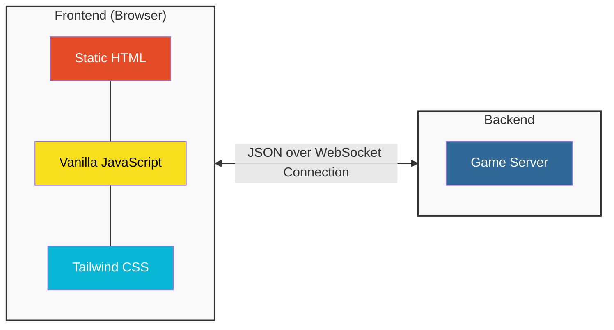

# Knockout Whist

A full-stack implementation of Knockout Whist.

## Architecture




## Design goals

* Mobile-friendly
* Simple UI
* Seamless reconnects

## Implementation goals

* <1,000 lines of code
* Single server for simple deployment
* No frontend frameworks

## Try

Go to https://knockout-whist.onrender.com (be patient: first load takes 1min+ on Render's free plan)

## Run

### With [uv](https://docs.astral.sh/uv/)

`uvx --from knockout-whist knockout-whist`

### With pip

`pip install knockout-whist` and then `knockout-whist`

### With Docker

`docker build -t knockout-whist .` then `docker run -p 8000:8000 knockout-whist`

## Develop

```
git clone https://github.com/tech4bueno/knockout-whist
pip install -e .[test]
pytest
```

## Deploy

Deploys easily to Render's free plan.

[](https://render.com/deploy)
